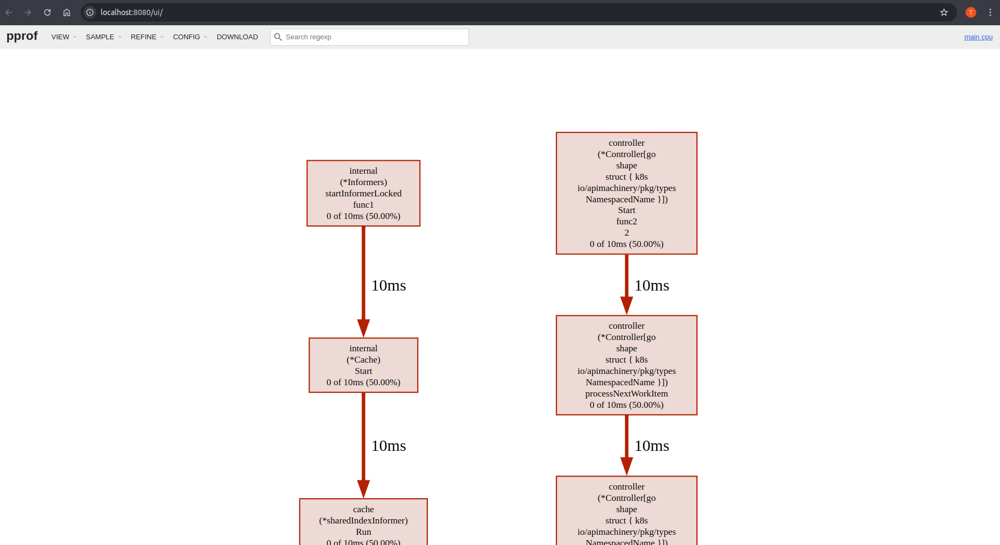

# 使用 Pprof 监控性能

[Pprof][github] 是 Go 的性能分析工具，可用于定位 CPU、内存等方面的瓶颈。它与 controller-runtime 的 HTTP 服务器集成，可通过 HTTP 端点进行分析；并可使用 `go tool pprof` 进行可视化。由于 [Pprof][github] 已内置在 controller-runtime 中，无需单独安装。借助 [Manager 选项][manager-options-doc]，你可以方便地启用 pprof 并收集运行时指标，以优化控制器性能。

<aside class="note warning">
<h1>不建议在生产环境长期开启</h1>

尽管 [Pprof][github] 非常适合性能分析与调试，但不建议在生产环境长期启用，主要原因：

1. **安全风险**：分析端点会暴露应用性能与资源使用的细节，若被未授权访问可能带来风险。
2. **运行开销**：分析过程会引入一定的性能开销（尤其是 CPU），在高负载下可能影响线上业务。

</aside>

## 如何使用 Pprof？

1. **启用 Pprof**

    在 `cmd/main.go` 中添加：

    ```golang
    mgr, err := ctrl.NewManager(ctrl.GetConfigOrDie(), ctrl.Options{
      ...
      // PprofBindAddress is the TCP address that the controller should bind to
      // for serving pprof. Specify the manager address and the port that should be bind.
      PprofBindAddress:       ":8082",
      ...
    })
    ```

2. **试运行**

    启用 [Pprof][github] 后，构建并部署你的控制器进行验证。参考[快速开始][quick-start-run-it]在本地或集群中运行你的项目。

    随后应用你的 CR/示例以观察控制器的性能表现。

3. **导出数据**

    使用 `curl` 导出分析数据到文件：

    ```bash
    # 注意：这里使用的是在 cmd/main.go Manager 选项中配置的地址与端口
    curl -s "http://127.0.0.1:8082/debug/pprof/profile" > ./cpu-profile.out
    ```

4. **在浏览器中可视化结果**

    ```bash
    # Go 工具会在本地 8080 端口开启一个会话（可自定义端口）
    go tool pprof -http=:8080 ./cpu-profile.out
    ```

    可视化结果会随部署的工作负载与控制器行为而变化。你将看到类似如下的效果：

    

[manager-options-doc]: https://pkg.go.dev/sigs.k8s.io/controller-runtime/pkg/manager
[quick-start-run-it]: ../quick-start.md#test-it-out
[github]: https://github.com/google/pprof
